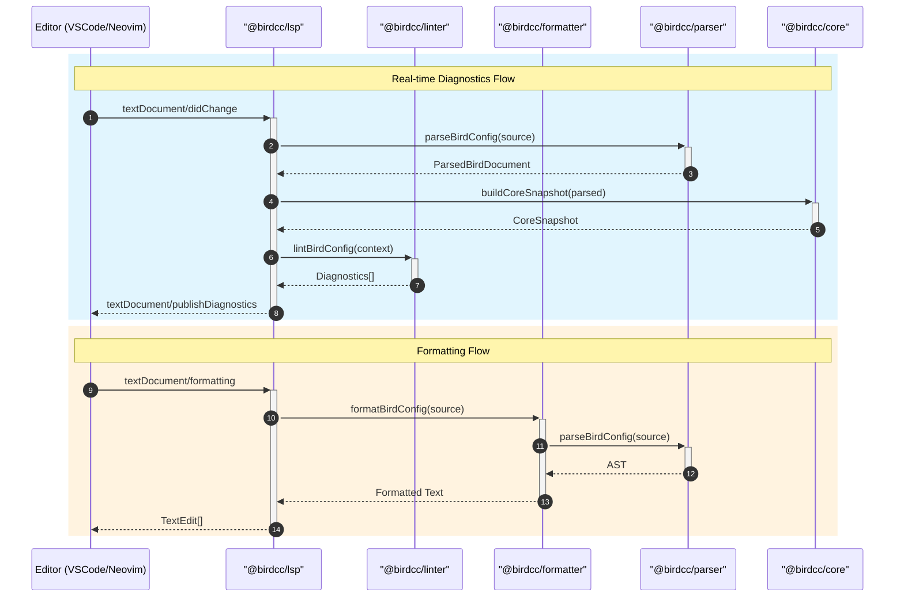
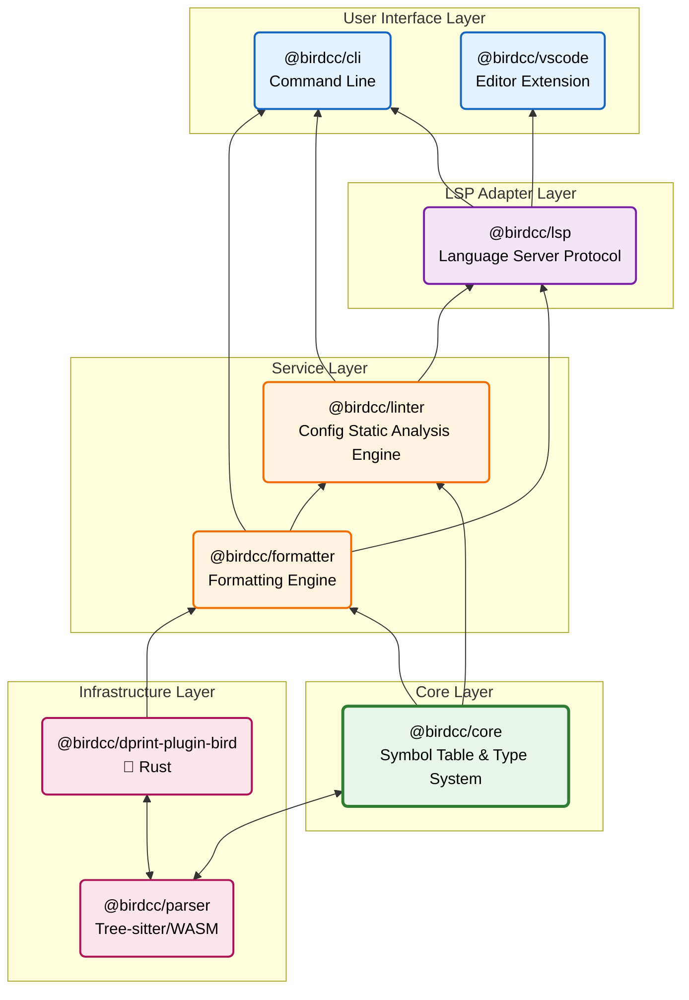

<div align="center">

# 🕊 BIRD2 LSP Project

</div>

<p align="center">
  <strong>Modern Language Server Protocol support for BIRD2 configuration files</strong>
</p>

<p align="center">
  <a href="https://github.com/bird-chinese-community/BIRD-LSP/releases">
    
  </a>
  <a href="https://github.com/bird-chinese-community/BIRD-LSP/blob/main/LICENSE">
    
  </a>
  <a href="https://www.typescriptlang.org/">
    
  </a>
  <a href="https://www.npmjs.com/package/@birdcc/cli">
    
  </a>
</p>

<div align="center">

English Version | [中文文档](./README.zh.md)

</div>

> [Overview](#overview) · [Features](#features) · [Quick Start](#quick-start) · [Packages](#packages) · [Architecture](#architecture) · [Development](#development)

---

## Overview

**BIRD-LSP** is a modern toolchain for [BIRD2](https://bird.network.cz/) configuration files, providing Language Server Protocol (LSP) support, code formatting, and static analysis.

---

## Features

| Feature                      | Description                                                 |
| ---------------------------- | ----------------------------------------------------------- |
| 🎨 **Syntax Highlighting**   | Tree-sitter based precise parsing                           |
| 🔍 **Real-time Diagnostics** | 32+ lint rules + cross-file analysis + `bird -p` validation |
| 📝 **Code Formatting**       | Dual-engine formatter (dprint + builtin) with safe mode     |
| 💡 **IntelliSense**          | Smart completion for protocols, filters, functions          |
| 🔎 **Hover Information**     | Type info and documentation on hover                        |
| 🏗️ **Symbol Navigation**     | Go to definition, find references (cross-file)              |

---

## Quick Start

### Install CLI

```bash
npm install -g @birdcc/cli
# or
pnpm add -g @birdcc/cli
```

### Usage

```bash
# Lint a BIRD config file
birdcc lint bird.conf

# Format a file
birdcc fmt bird.conf --write

# Start LSP server
birdcc lsp --stdio
```

### VS Code Extension

Search for **"BIRD2 LSP"** in VS Code Marketplace or install from [Open VSX](https://open-vsx.org/extension/birdcc/bird2-lsp).

---

## Packages

| Package                                                              | Version     | Description                  | Documentation                                             |
| -------------------------------------------------------------------- | ----------- | ---------------------------- | --------------------------------------------------------- |
| [@birdcc/parser](./packages/@birdcc/parser/)                         | 0.1.0-alpha | Tree-sitter parser for BIRD2 | [README](./packages/@birdcc/parser/README.md)             |
| [@birdcc/core](./packages/@birdcc/core/)                             | 0.1.0-alpha | Semantic analysis engine     | [README](./packages/@birdcc/core/README.md)               |
| [@birdcc/linter](./packages/@birdcc/linter/)                         | 0.1.0-alpha | Pluggable lint rule system   | [README](./packages/@birdcc/linter/README.md)             |
| [@birdcc/lsp](./packages/@birdcc/lsp/)                               | 0.1.0-alpha | LSP server implementation    | [README](./packages/@birdcc/lsp/README.md)                |
| [@birdcc/formatter](./packages/@birdcc/formatter/)                   | 0.1.0-alpha | Dual-engine code formatter   | [README](./packages/@birdcc/formatter/README.md)          |
| [@birdcc/cli](./packages/@birdcc/cli/)                               | 0.1.0-alpha | Command-line interface       | [README](./packages/@birdcc/cli/README.md)                |
| [@birdcc/vscode](./packages/@birdcc/vscode/)                         | 0.1.0-alpha | VS Code extension            | [README](./packages/@birdcc/vscode/README.md)             |
| [@birdcc/dprint-plugin-bird](./packages/@birdcc/dprint-plugin-bird/) | 0.1.0-alpha | dprint plugin (Rust/WASM)    | [README](./packages/@birdcc/dprint-plugin-bird/README.md) |

---

## Architecture

### Component Interaction



### Package Dependency Graph



---

## Development

```bash
# Clone with submodules
git clone --recursive https://github.com/bird-chinese-community/BIRD-LSP.git
cd BIRD-LSP

# Install dependencies
pnpm install

# Build all packages
pnpm build

# Run tests
pnpm test
```

---

### 📖 Documentation

- [BIRD Official Documentation](https://bird.network.cz/)
- [BIRD2 User Manual](https://bird.network.cz/doc/bird.html)
- [Extension Configuration Guide](./docs/configuration.md)
- [Project Config Spec (`bird.config.json`)](./docs/spec.md)
- [FAQ / Troubleshooting](./docs/faq.md)
- [GitHub Project](https://github.com/bird-chinese-community/BIRD-LSP)

---

## 📝 License

This project is licensed under the [GPL-3.0 License](https://github.com/bird-chinese-community/BIRD-LSP/blob/main/LICENSE).

---

<p align="center">
  <sub>Built with ❤️ by the BIRD Chinese Community (BIRDCC)</sub>
</p>

<p align="center">
  <a href="https://github.com/bird-chinese-community/BIRD-LSP">🕊 GitHub</a> ·
  <a href="https://marketplace.visualstudio.com/items?itemName=birdcc.bird2-lsp">🛒 Marketplace</a> ·
  <a href="https://github.com/bird-chinese-community/BIRD-LSP/issues">🐛 Report Issues</a>
</p>
