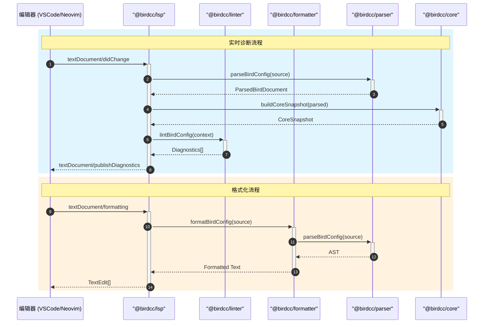
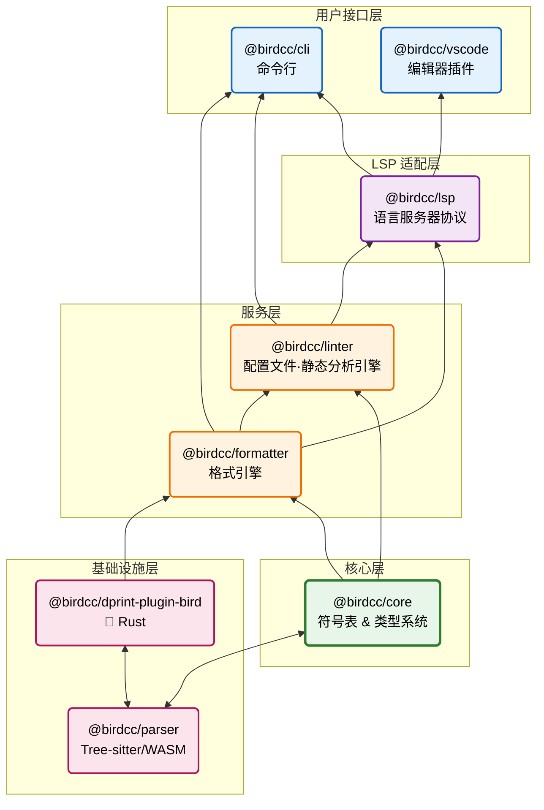

<div align="center">

# 🕊 BIRD2 LSP Project

</div>

<p align="center">
  <strong>为 BIRD2 配置文件提供现代化的 Language Server Protocol 支持</strong>
</p>

<p align="center">
  <a href="https://marketplace.visualstudio.com/items?itemName=birdcc.bird2-lsp">
    
  </a>
  <a href="https://open-vsx.org/extension/birdcc/bird2-lsp">
    
  </a>
  <a href="https://www.typescriptlang.org/">
    
  </a>
  <a href="https://www.npmjs.com/package/@birdcc/cli">
    
  </a>
</p>

<p align="center">
    <a href="https://github.com/bird-chinese-community/BIRD-LSP/blob/main/LICENSE">
    
  </a>
  <a href="https://github.com/bird-chinese-community/BIRD-LSP/actions/workflows/cross-platform-compat.yml">
    
  </a>
  <a href="https://github.com/bird-chinese-community/BIRD-LSP/actions/workflows/sync-config-examples.yml">
    
  </a>
</p>

<div align="center">

[English Version](./README.md) | 中文文档

</div>

> [概述](#概述) · [功能特性](#功能特性) · [快速开始](#快速开始) · [包列表](#包列表) · [架构](#架构) · [开发](#开发)

---

## 概述

**BIRD-LSP** 是一个专为 [BIRD2](https://bird.network.cz/) 配置文件打造的现代化工具链项目，提供 Language Server Protocol (LSP) 支持、代码格式化 (Formatter) 与静态分析 (Linter) 能力。

---

## 功能特性

| 功能              | 描述                                             |
| ----------------- | ------------------------------------------------ |
| 🎨 **语法高亮**   | 基于 Tree-sitter 的高精度语法解析                |
| 🔍 **实时诊断**   | 32+ 条 Lint 规则 + 跨文件分析 + `bird -p` 校验   |
| 📝 **代码格式化** | 双引擎格式化器（dprint + builtin），支持安全模式 |
| 💡 **智能补全**   | Protocol、Filter、Function 智能补全              |
| 🔎 **悬停提示**   | 类型信息和文档说明                               |
| 🏗️ **符号导航**   | 跳转到定义、查找引用（支持跨文件）               |

---

## 快速开始

### 安装 CLI

```bash
npm install -g @birdcc/cli
# 或
pnpm add -g @birdcc/cli
```

### 使用

```bash
# 检查 BIRD 配置文件
birdcc lint bird.conf

# 格式化文件
birdcc fmt bird.conf --write

# 启动 LSP 服务器
birdcc lsp --stdio
```

### VS Code 扩展

在 VS Code Marketplace 搜索 **"BIRD2 LSP"** 或从 [Open VSX](https://open-vsx.org/extension/birdcc/bird2-lsp) 安装。

---

## 包列表

| 包名                                                                 | 版本        | 描述                    | 文档                                                      |
| -------------------------------------------------------------------- | ----------- | ----------------------- | --------------------------------------------------------- |
| [@birdcc/parser](./packages/@birdcc/parser/)                         | 0.1.0-alpha | Tree-sitter 解析器      | [README](./packages/@birdcc/parser/README.md)             |
| [@birdcc/core](./packages/@birdcc/core/)                             | 0.1.0-alpha | 语义分析引擎            | [README](./packages/@birdcc/core/README.md)               |
| [@birdcc/linter](./packages/@birdcc/linter/)                         | 0.1.0-alpha | 可插拔 Lint 规则系统    | [README](./packages/@birdcc/linter/README.md)             |
| [@birdcc/lsp](./packages/@birdcc/lsp/)                               | 0.1.0-alpha | LSP 服务器实现          | [README](./packages/@birdcc/lsp/README.md)                |
| [@birdcc/formatter](./packages/@birdcc/formatter/)                   | 0.1.0-alpha | 双引擎代码格式化器      | [README](./packages/@birdcc/formatter/README.md)          |
| [@birdcc/cli](./packages/@birdcc/cli/)                               | 0.1.0-alpha | 命令行工具              | [README](./packages/@birdcc/cli/README.md)                |
| [@birdcc/vscode](./packages/@birdcc/vscode/)                         | 0.1.0-alpha | VS Code 扩展            | [README](./packages/@birdcc/vscode/README.md)             |
| [@birdcc/dprint-plugin-bird](./packages/@birdcc/dprint-plugin-bird/) | 0.1.0-alpha | dprint 插件 (Rust/WASM) | [README](./packages/@birdcc/dprint-plugin-bird/README.md) |

---

## 架构

### 组件交互



### 包依赖图



---

## 开发

```bash
# 克隆仓库（包含 submodules）
git clone --recursive https://github.com/bird-chinese-community/BIRD-LSP.git
cd BIRD-LSP

# 安装依赖
pnpm install

# 构建所有包
pnpm build

# 运行测试
pnpm test
```

---

### 📖 文档

- [BIRD Official Documentation](https://bird.network.cz/)
- [BIRD2 User Manual](https://bird.network.cz/doc/bird.html)
- [Extension Configuration Guide](./docs/configuration.md)
- [Project Config Spec (`bird.config.json`)](./docs/spec.md)
- [FAQ / Troubleshooting](./docs/faq.md)
- [GitHub Project](https://github.com/bird-chinese-community/BIRD-LSP)

---

## 📝 许可证

本项目采用 [GPL-3.0 License](https://github.com/bird-chinese-community/BIRD-LSP/blob/main/LICENSE) 开源许可。

---

<p align="center">
  <sub>Built with ❤️ by the BIRD Chinese Community (BIRDCC)</sub>
</p>

<p align="center">
  <a href="https://github.com/bird-chinese-community/BIRD-LSP">🕊 GitHub</a> ·
  <a href="https://marketplace.visualstudio.com/items?itemName=birdcc.bird2-lsp">🛒 Marketplace</a> ·
  <a href="https://github.com/bird-chinese-community/BIRD-LSP/issues">🐛 Report Issues</a>
</p>
