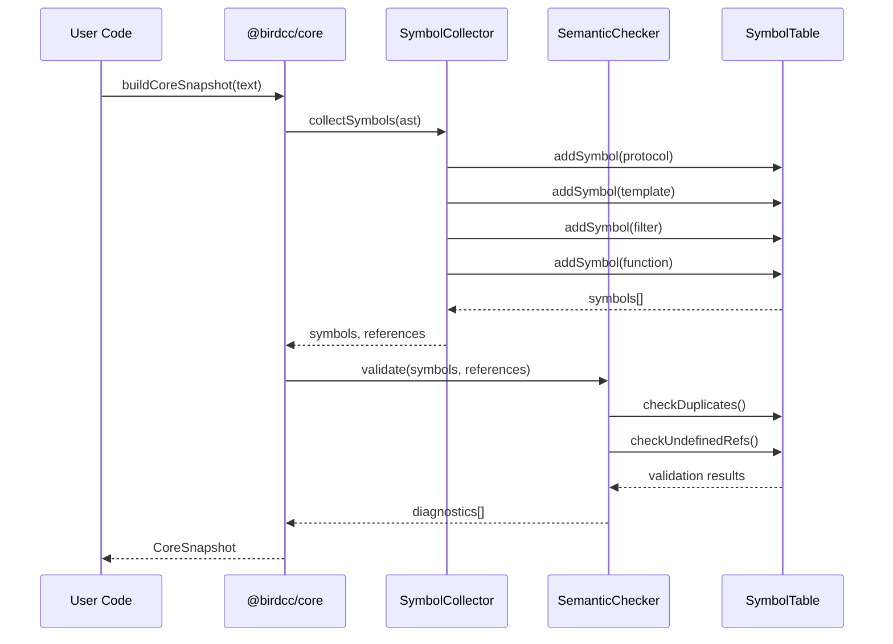

<div align="center">

# 🦅 BIRD Config Core (@birdcc/core)

</div>

[](https://www.npmjs.com/package/@birdcc/core) [](https://www.gnu.org/licenses/gpl-3.0) [](https://www.typescriptlang.org/)

> [Overview](#overview) · [Features](#features) · [Installation](#installation) · [Usage](#usage) · [API Reference](#api-reference) · [Architecture](#architecture)

## Overview

**@birdcc/core** is the semantic analysis engine for BIRD2 configuration files, providing symbol table construction, type checking, and cross-file resolution capabilities.

### Core Highlights

| Feature            | Description                                                           |
| ------------------ | --------------------------------------------------------------------- |
| 🔍 Symbol Table    | Automatic collection of protocol/template/filter/function definitions |
| ⚠️ Semantic Checks | Detect duplicate definitions and undefined references                 |
| 📋 Diagnostics     | Standardized diagnostic format with error/warning/info levels         |
| 🔗 Cross-file      | Support for `include` statements and cross-file symbol resolution     |

---

## Features

### Symbol Table Construction

Automatically extracts and indexes:

- **`protocol`** — Protocol definitions (BGP/OSPF/Static/Direct/etc.)
- **`template`** — Protocol templates with inheritance support
- **`filter`** — Filter function definitions
- **`function`** — Custom function definitions
- **`table`** — Routing table declarations

### Semantic Validation

- **Duplicate Detection** — Identifies redefined symbols
- **Undefined References** — Detects references to non-existent templates
- **Type Checking** — Validates type compatibility in expressions
- **Scope Analysis** — Tracks variable scope within filters/functions

### Cross-file Resolution

- **`include` Support** — Parse and merge included configuration files
- **Circular Detection** — Detect circular include dependencies
- **Symbol Merging** — Combine symbol tables from multiple files

---

## Installation

```bash
# Using pnpm (recommended)
pnpm add @birdcc/core

# Using npm
npm install @birdcc/core

# Using yarn
yarn add @birdcc/core
```

### Prerequisites

- Node.js >= 18
- TypeScript >= 5.0 (if using TypeScript)

---

## Usage

### Basic Semantic Analysis

```typescript
import { buildCoreSnapshot } from "@birdcc/core";

const config = `
protocol bgp upstream {
    local as 65001;
    neighbor 192.168.1.1 as 65002;
}

protocol bgp upstream {  // ← Duplicate definition!
    local as 65001;
}
`;

const snapshot = buildCoreSnapshot(config);

console.log(snapshot.symbols);
// [
//   { kind: "protocol", name: "upstream", line: 2, column: 12 },
//   { kind: "protocol", name: "upstream", line: 7, column: 12 }
// ]

console.log(snapshot.diagnostics);
// [
//   {
//     code: "semantic/duplicate-definition",
//     message: "protocol 'upstream' is defined multiple times",
//     severity: "error",
//     ...
//   }
// ]
```

### Using with Parser

```typescript
import { parseBirdConfig } from "@birdcc/parser";
import { buildCoreSnapshotFromParsed } from "@birdcc/core";

const parsed = await parseBirdConfig(source);
const snapshot = buildCoreSnapshotFromParsed(parsed);

// Access symbols and diagnostics
console.log(`Found ${snapshot.symbols.length} symbols`);
console.log(`Found ${snapshot.diagnostics.length} issues`);
```

### Cross-file Analysis

```typescript
import { resolveCrossFileReferences } from "@birdcc/core";

const result = await resolveCrossFileReferences(mainFile, {
  includePaths: ["./config", "./templates"],
  maxDepth: 10,
});

console.log(result.mergedSymbols);
console.log(result.diagnostics);
```

---

## API Reference

### Main Functions

#### `buildCoreSnapshot(text: string): CoreSnapshot`

Build a semantic analysis snapshot from raw text.

```typescript
import { buildCoreSnapshot } from "@birdcc/core";

const snapshot = buildCoreSnapshot(birdConfigText);
// snapshot.symbols      → List of symbol definitions
// snapshot.diagnostics  → List of diagnostic messages
```

#### `buildCoreSnapshotFromParsed(parsed: ParsedBirdDocument): CoreSnapshot`

Build a semantic analysis snapshot from an already parsed AST.

```typescript
import { parseBirdConfig } from "@birdcc/parser";
import { buildCoreSnapshotFromParsed } from "@birdcc/core";

const parsed = await parseBirdConfig(text);
const snapshot = buildCoreSnapshotFromParsed(parsed);
```

### Core Types

#### `CoreSnapshot`

```typescript
interface CoreSnapshot {
  /** All symbol definitions */
  symbols: SymbolDefinition[];
  /** Template reference information */
  references: SymbolReference[];
  /** Semantic check diagnostics */
  diagnostics: BirdDiagnostic[];
}
```

#### `SymbolDefinition`

```typescript
interface SymbolDefinition {
  kind: "protocol" | "template" | "filter" | "function" | "table";
  name: string;
  line: number;
  column: number;
  endLine: number;
  endColumn: number;
}
```

#### `BirdDiagnostic`

```typescript
interface BirdDiagnostic {
  code: string;
  message: string;
  severity: "error" | "warning" | "info";
  source: string;
  range: {
    line: number;
    column: number;
    endLine: number;
    endColumn: number;
  };
}
```

### Diagnostic Codes

| Code                            | Description                     | Level   |
| ------------------------------- | ------------------------------- | ------- |
| `semantic/duplicate-definition` | Duplicate symbol definition     | error   |
| `semantic/undefined-reference`  | Reference to undefined template | error   |
| `semantic/type-mismatch`        | Type compatibility error        | error   |
| `semantic/invalid-scope`        | Variable scope violation        | warning |

---

## Architecture

### Layer Position

```mermaid
flowchart TB
    subgraph "Rule Engine"
        A[@birdcc/linter]
    end

    subgraph "Semantic Analysis"
        B[@birdcc/core]
    end

    subgraph "Syntax Parsing"
        C[@birdcc/parser]
    end

    A -->|uses| B
    B -->|uses| C

    style A fill:#e1f5fe
    style B fill:#fff3e0
    style C fill:#e8f5e9
```

### Internal Components

```mermaid
flowchart TB
    subgraph "Input"
        SRC[BIRD Config Source]
    end

    subgraph "Parser Layer"
        P[@birdcc/parser<br/>Tree-sitter]
        AST[AST<br/>Abstract Syntax Tree]
    end

    subgraph "Core Layer"
        SC[Symbol Collector]
        ST[(Symbol Table)]
        SEM[Semantic Checker]
        DIAG[Diagnostics]
    end

    SRC --> P
    P --> AST
    AST --> SC
    SC --> ST
    ST --> SEM
    SEM --> DIAG

    style ST fill:#fff3e0
    style DIAG fill:#ffebee
```

### Symbol Resolution Flow



---

## Related Packages

| Package                            | Description                    |
| ---------------------------------- | ------------------------------ |
| [@birdcc/parser](../parser/)       | Tree-sitter grammar and parser |
| [@birdcc/linter](../linter/)       | 32+ lint rules and diagnostics |
| [@birdcc/formatter](../formatter/) | Code formatting engine         |
| [@birdcc/lsp](../lsp/)             | LSP server implementation      |
| [@birdcc/cli](../cli/)             | Command-line interface         |

---

### 📖 Documentation

- [BIRD Official Documentation](https://bird.network.cz/)
- [BIRD2 User Manual](https://bird.network.cz/doc/bird.html)
- [GitHub Project](https://github.com/bird-chinese-community/BIRD-LSP)

---

## 📝 License

This project is licensed under the [GPL-3.0 License](https://github.com/bird-chinese-community/BIRD-LSP/blob/main/LICENSE).

---

<p align="center">
  <sub>Built with ❤️ by the BIRD Chinese Community (BIRDCC)</sub>
</p>

<p align="center">
  <a href="https://github.com/bird-chinese-community/BIRD-LSP">🕊 GitHub</a> ·
  <a href="https://marketplace.visualstudio.com/items?itemName=birdcc.bird2-lsp">🛒 Marketplace</a> ·
  <a href="https://github.com/bird-chinese-community/BIRD-LSP/issues">🐛 Report Issues</a>
</p>
