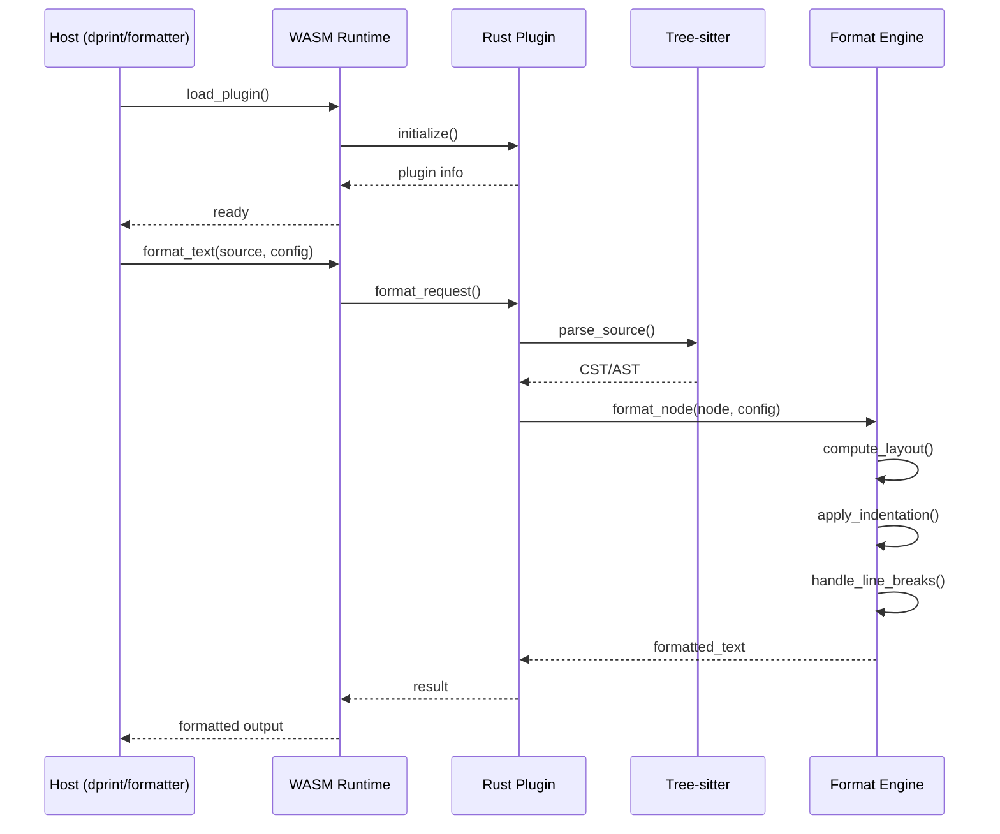
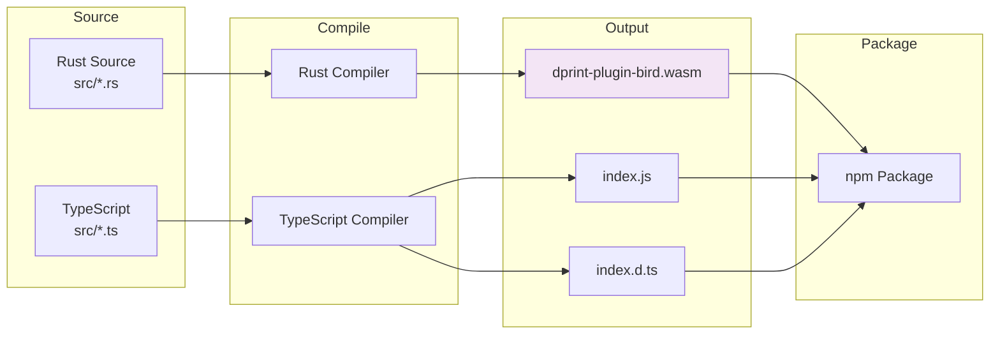

<div align="center">

# 🔧 dprint Plugin for BIRD Config (@birdcc/dprint-plugin-bird)

</div>

[](https://www.npmjs.com/package/@birdcc/dprint-plugin-bird) [](https://www.gnu.org/licenses/gpl-3.0) [](https://www.rust-lang.org/) [](https://webassembly.org/)

> [Overview](#overview) · [Features](#features) · [Installation](#installation) · [Usage](#usage) · [Configuration](#configuration) · [Architecture](#architecture) · [Development](#development)

## Overview

**@birdcc/dprint-plugin-bird** is the official dprint plugin for BIRD Internet Routing Daemon (BIRD2) configuration files. Built with Rust and compiled to WebAssembly, it delivers blazing-fast, cross-platform code formatting.

This plugin is part of the [BIRD-LSP](https://github.com/bird-chinese-community/BIRD-LSP) toolchain, providing enterprise-grade formatting capabilities for network engineers.

---

## Features

| Feature | Description |
| ------- | ----------- |
| 🚀 **Rust Performance** | Core engine written in Rust for maximum speed |
| 🌍 **Cross-Platform WASM** | Compiled to wasm32-wasip1 for consistent behavior |
| 🔌 **dprint Compatible** | Seamlessly integrates with dprint CLI and editors |
| 🌳 **Tree-sitter** | Leverages Tree-sitter for syntax-aware formatting |
| ⚙️ **Configurable** | Supports `lineWidth`, `indentWidth`, `safeMode` |
| 🦀 **Memory Safe** | Rust's ownership model guarantees safety |

---

## Installation

### Prerequisites

- **Rust** ≥ 1.70
- **wasm32-wasip1** target
- **Node.js** ≥ 20

### Setup Rust WASM Target

```bash
rustup target add wasm32-wasip1
```

### Install via npm

```bash
npm install @birdcc/dprint-plugin-bird
```

---

## Usage

### With dprint CLI

Add to your `dprint.json`:

```json
{
  "plugins": [
    "https://npmjs.com/@birdcc/dprint-plugin-bird/dprint-plugin-bird.wasm"
  ],
  "bird": {
    "lineWidth": 100,
    "indentWidth": 2,
    "safeMode": true
  }
}
```

Then run:

```bash
dprint fmt bird.conf
dprint check bird.conf
```

### Via @birdcc/formatter

When configured with `engine: "dprint"`, this plugin is automatically used:

```json
{
  "$schema": "https://birdcc.link/schemas/birdcc-tooling.schema.json",
  "formatter": {
    "engine": "dprint",
    "indentSize": 2,
    "lineWidth": 100,
    "safeMode": true
  }
}
```

### Programmatic Usage

```typescript
import { getPath, getBuffer } from "@birdcc/dprint-plugin-bird";

// Get WASM file path
const wasmPath = getPath();

// Or get WASM buffer directly
const wasmBuffer = getBuffer();
```

---

## Configuration

### Options

| Option | Type | Default | Description |
| ------ | ---- | ------- | ----------- |
| `lineWidth` | `number` | `80` | Maximum line length |
| `indentWidth` | `number` | `2` | Spaces per indentation level |
| `safeMode` | `boolean` | `true` | Enable safe mode to prevent errors |

---

## Architecture

### Plugin Architecture

```mermaid
flowchart TB
    subgraph "Host Environment"
        D1[dprint CLI]
        D2[Editor Plugin]
        D3[@birdcc/formatter]
    end

    subgraph "WASM Runtime"
        WASM[WASM Module<br/>wasm32-wasip1]
        HOST[Host Functions]
    end

    subgraph "Rust Core"
        R1[Plugin Entry]
        R2[Configuration]
        R3[Format Engine]
    end

    subgraph "Parsing"
        P1[Tree-sitter Parser]
        P2[AST Builder]
    end

    subgraph "Formatting"
        F1[Layout Engine]
        F2[Indentation]
        F3[Line Breaking]
    end

    subgraph "Output"
        O[Formatted Text]
    end

    D1 --> WASM
    D2 --> WASM
    D3 --> WASM
    WASM --> HOST
    HOST --> R1
    R1 --> R2
    R1 --> R3
    R3 --> P1
    P1 --> P2
    P2 --> F1
    F1 --> F2
    F1 --> F3
    F2 --> O
    F3 --> O

    style WASM fill:#f3e5f5
    style R3 fill:#e8f5e9
```

### Data Flow



### Build Pipeline



---

## Development

### Build

Execute from the monorepo root:

```bash
pnpm build
```

This command performs:

1. Compiles Rust code to WebAssembly (`wasm32-wasip1`)
2. Generates TypeScript declaration files
3. Outputs to the `dist/` directory

### Manual Build Steps

```bash
# Build WASM
node scripts/build-wasm.mjs

# Compile TypeScript
tsc -p tsconfig.json
```

### Project Structure

| Path | Description |
| ---- | ----------- |
| `src/lib.rs` | Library entry point |
| `src/configuration.rs` | Configuration structures |
| `src/format_text.rs` | Core formatting implementation |
| `src/wasm_plugin.rs` | WASM bindings |
| `src/index.ts` | TypeScript bindings |
| `scripts/build-wasm.mjs` | WASM build script |
| `dist/` | Build output directory |

### Available Scripts

| Command | Description |
| ------- | ----------- |
| `pnpm build` | Build WASM + TypeScript |
| `pnpm test` | Run Rust unit tests |
| `pnpm typecheck` | Run TypeScript type checking |
| `pnpm lint` | Run oxlint and cargo clippy |
| `pnpm format` | Format code using oxfmt |

### Testing

```bash
# Run Rust tests
cargo test

# Run with output
cargo test -- --nocapture
```

---

## Relationship with @birdcc/formatter

| Package | Role | Description |
| ------- | ---- | ----------- |
| `@birdcc/dprint-plugin-bird` | **dprint Plugin** | Official dprint plugin for BIRD2 |
| `@birdcc/formatter` | **Abstraction Layer** | Unified interface with multiple engines |

`@birdcc/formatter` serves as a higher-level abstraction that can use this dprint plugin as its backend, while also providing a built-in fallback formatter.

---

## Related Packages

| Package | Description |
| ------- | ----------- |
| [@birdcc/parser](../parser/) | Tree-sitter grammar and parser |
| [@birdcc/core](../core/) | Semantic analysis engine |
| [@birdcc/formatter](../formatter/) | Unified formatting interface |
| [@birdcc/linter](../linter/) | Lint rules and diagnostics |
| [@birdcc/lsp](../lsp/) | LSP server implementation |
| [@birdcc/cli](../cli/) | Command-line interface |

---

### 📖 Documentation

- [BIRD Official Documentation](https://bird.network.cz/)
- [BIRD2 User Manual](https://bird.network.cz/doc/bird.html)
- [dprint Documentation](https://dprint.dev/)
- [GitHub Project](https://github.com/bird-chinese-community/BIRD-LSP)

---

## 📝 License

GPL-3.0-only © [BIRD Chinese Community](https://github.com/bird-chinese-community/)

---

<p align="center">
  <sub>Built with ❤️ by the BIRD Chinese Community (BIRDCC)</sub>
</p>

<p align="center">
  <a href="https://github.com/bird-chinese-community/BIRD-LSP">🕊 GitHub</a> ·
  <a href="https://marketplace.visualstudio.com/items?itemName=birdcc.bird2-lsp">🛒 Marketplace</a> ·
  <a href="https://github.com/bird-chinese-community/BIRD-LSP/issues">🐛 Report Issues</a>
</p>
