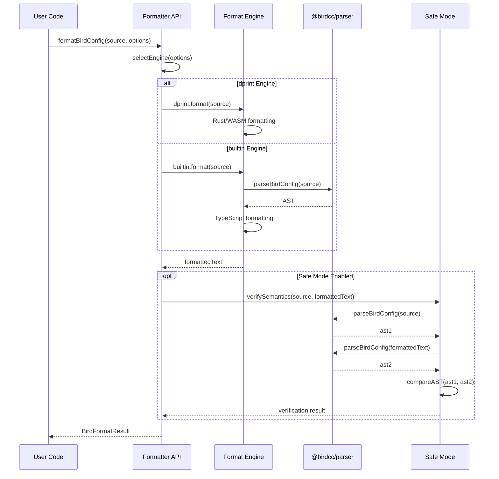
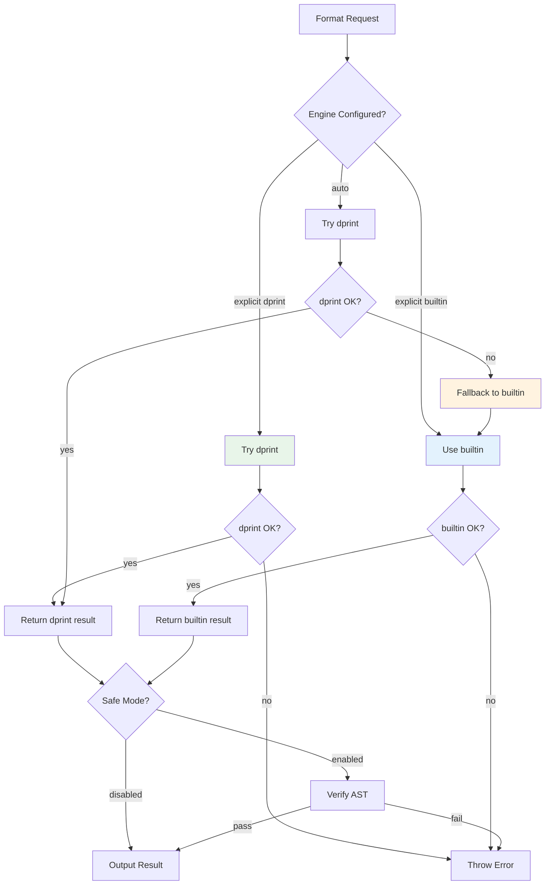

<div align="center">

# 🎨 BIRD Config Formatter (@birdcc/formatter)

</div>

<div align="center">

> ⚠️ **Alpha Stage**: This package is in early development. APIs may change frequently, and unexpected issues may occur. Please evaluate carefully before deploying in production environments.

</div>

[](https://www.npmjs.com/package/@birdcc/formatter) [](https://www.gnu.org/licenses/gpl-3.0) [](https://www.typescriptlang.org/)

> [Overview](#overview) · [Features](#features) · [Installation](#installation) · [Usage](#usage) · [Configuration](#configuration) · [API Reference](#api-reference) · [Architecture](#architecture)

## Overview

**@birdcc/formatter** is the formatting component in the BIRD-LSP toolchain, purpose-built for [BIRD Internet Routing Daemon](https://bird.network.cz/) configuration files. It employs a **dual-engine architecture** combining dprint performance with builtin reliability.

---

## Features

| Feature                  | Description                                       |
| ------------------------ | ------------------------------------------------- |
| ⚡ **dprint Engine**     | Rust/WASM-based for lightning-fast formatting     |
| 🛡️ **Builtin Fallback**  | Automatic fallback when dprint is unavailable     |
| 🔒 **Safe Mode**         | AST semantic verification before/after formatting |
| 🔄 **Async API**         | Promise-based interface for modern architectures  |
| 🧩 **Zero Dependencies** | Builtin engine requires no external deps          |

---

## Installation

```bash
# Using pnpm (recommended)
pnpm add @birdcc/formatter

# Using npm
npm install @birdcc/formatter

# Using yarn
yarn add @birdcc/formatter
```

### Prerequisites

- Node.js >= 18
- TypeScript >= 5.0 (if using TypeScript)

---

## Usage

### Basic Formatting

```typescript
import { formatBirdConfig } from "@birdcc/formatter";

const source = `
protocol bgp bgp_peer {
local as 65001;
neighbor 192.0.2.1 as 65002;
}
`;

const formatted = await formatBirdConfig(source, {
  engine: "dprint",
  safeMode: true,
});

console.log(formatted.text);
console.log(`Changed: ${formatted.changed}`);
console.log(`Engine: ${formatted.engine}`);
```

### Format Checking

```typescript
import { checkBirdConfigFormat } from "@birdcc/formatter";

const result = await checkBirdConfigFormat(source);
console.log(`Needs formatting: ${result.changed}`);
```

### Using Builtin Engine

```typescript
const formatted = await formatBirdConfig(source, {
  engine: "builtin",
  indentSize: 4,
  safeMode: true,
});
```

---

## Configuration

### Options

| Option       | Type                      | Default    | Description                       |
| ------------ | ------------------------- | ---------- | --------------------------------- |
| `engine`     | `'dprint'` \| `'builtin'` | `'dprint'` | Formatter engine selection        |
| `safeMode`   | `boolean`                 | `true`     | Enable semantic equivalence check |
| `indentSize` | `number`                  | `2`        | Number of spaces for indentation  |
| `lineWidth`  | `number`                  | `80`       | Maximum line width                |

### Configuration Details

- **`engine`**: `dprint` uses Rust/WASM; `builtin` uses TypeScript as fallback
- **`safeMode`**: Compares AST fingerprints to ensure semantic equivalence
- **`indentSize`**: Indentation spaces (positive integer)
- **`lineWidth`**: Target line width (positive integer)

---

## API Reference

### `formatBirdConfig(text, options?)`

Format BIRD2 configuration file content.

```typescript
import { formatBirdConfig } from "@birdcc/formatter";

const result = await formatBirdConfig(text, options);
// result.text    → Formatted content
// result.changed → Whether changes were made
// result.engine  → Engine used
```

**Parameters:**

- `text: string` — The configuration file content to format
- `options?: FormatBirdConfigOptions` — Formatting options

**Returns:** `Promise<BirdFormatResult>`

### `checkBirdConfigFormat(text, options?)`

Check if the configuration file needs formatting (without actually formatting).

```typescript
import { checkBirdConfigFormat } from "@birdcc/formatter";

const result = await checkBirdConfigFormat(text, options);
// result.changed → Whether formatting is needed
```

### Type Definitions

```typescript
interface FormatBirdConfigOptions {
  engine?: "dprint" | "builtin";
  safeMode?: boolean;
  indentSize?: number;
  lineWidth?: number;
}

interface BirdFormatResult {
  text: string;
  changed: boolean;
  engine: "dprint" | "builtin";
}

interface BirdFormatCheckResult {
  changed: boolean;
}

type FormatterEngine = "dprint" | "builtin";
```

---

## Architecture

### Dual-Engine Architecture

```mermaid
flowchart TB
    subgraph "API Layer"
        API[formatBirdConfig]
    end

    subgraph "Engine Selection"
        SEL{Engine Selection}
    end

    subgraph "dprint Engine"
        D1[@birdcc/dprint-plugin-bird<br/>Rust/WASM]
        D2[Tree-sitter Parser]
        D3[Format Logic]
    end

    subgraph "Builtin Engine"
        B1[TypeScript Implementation]
        B2[Parser Adapter]
        B3[Format Logic]
    end

    subgraph "Safety Layer"
        SAFE{Safe Mode}
        AST1[Parse Original]
        AST2[Parse Formatted]
        CMP[AST Compare]
    end

    subgraph "Output"
        OUT[Formatted Text]
    end

    API --> SEL
    SEL -->|priority| D1
    SEL -->|fallback| B1
    D1 --> D2 --> D3
    B1 --> B2 --> B3
    D3 --> SAFE
    B3 --> SAFE
    SAFE -->|enabled| AST1
    SAFE -->|enabled| AST2
    AST1 --> CMP
    AST2 --> CMP
    CMP -->|verified| OUT
    SAFE -->|disabled| OUT

    style D1 fill:#e8f5e9
    style B1 fill:#e3f2fd
    style SAFE fill:#fff3e0
```

### Formatting Pipeline



### Engine Fallback Strategy



---

## Related Packages

| Package                                              | Description                     |
| ---------------------------------------------------- | ------------------------------- |
| [@birdcc/parser](../parser/)                         | Tree-sitter grammar and parser  |
| [@birdcc/core](../core/)                             | Semantic analysis engine        |
| [@birdcc/dprint-plugin-bird](../dprint-plugin-bird/) | dprint plugin (Rust/WASM)       |
| [@birdcc/linter](../linter/)                         | Lint rules and diagnostics      |
| [@birdcc/cli](../cli/)                               | CLI tool (`birdcc fmt` command) |
| [@birdcc/lsp](../lsp/)                               | LSP server implementation       |

---

### 📖 Documentation

- [BIRD Official Documentation](https://bird.network.cz/)
- [BIRD2 User Manual](https://bird.network.cz/doc/bird.html)
- [dprint Documentation](https://dprint.dev/)
- [GitHub Project](https://github.com/bird-chinese-community/BIRD-LSP)

---

## 📝 License

This project is licensed under the [GPL-3.0 License](https://github.com/bird-chinese-community/BIRD-LSP/blob/main/LICENSE).

---

<p align="center">
  <sub>Built with ❤️ by the BIRD Chinese Community (BIRDCC)</sub>
</p>

<p align="center">
  <a href="https://github.com/bird-chinese-community/BIRD-LSP">🕊 GitHub</a> ·
  <a href="https://marketplace.visualstudio.com/items?itemName=birdcc.bird2-lsp">🛒 Marketplace</a> ·
  <a href="https://github.com/bird-chinese-community/BIRD-LSP/issues">🐛 Report Issues</a>
</p>
