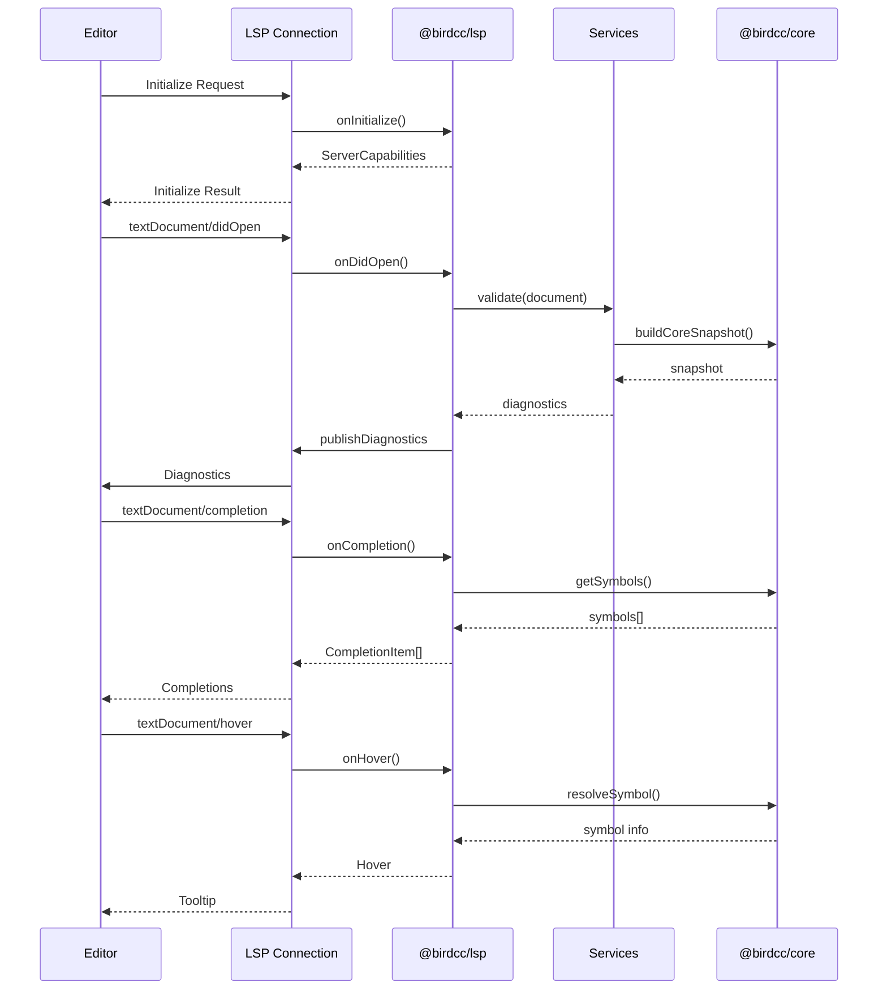
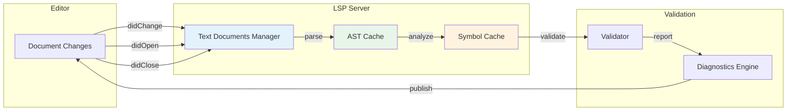

<div align="center">

# 🕊 BIRD Config LSP (@birdcc/lsp)

</div>

[](https://www.npmjs.com/package/@birdcc/lsp) [](https://www.gnu.org/licenses/gpl-3.0) [](https://www.typescriptlang.org/) [](https://github.com/microsoft/vscode-languageserver-node)

> [Overview](#overview) · [Features](#features) · [Installation](#installation) · [Usage](#usage) · [Editor Integration](#editor-integration) · [API Reference](#api-reference) · [Architecture](#architecture)

## Overview

**@birdcc/lsp** is the Language Server Protocol implementation for BIRD2 configuration files, delivering real-time diagnostics, intelligent code completion, hover tooltips, and more for editor integration.

| Package | Version | Description |
| ------- | ------- | ----------- |
| `@birdcc/lsp` | 0.1.0 | LSP server implementation with real-time diagnostics |

---

## Features

### LSP Capabilities

- **Incremental Synchronization** — `TextDocumentSyncKind.Incremental` for efficient handling of large files
- **Real-time Diagnostics** — Automatic validation on document open and modification
- **Code Completion** — Auto-completion for keywords, symbols, and snippets
- **Hover Information** — Type information and documentation on hover
- **Go to Definition** — Navigate to symbol definitions
- **Find References** — Find all references to a symbol
- **Document Symbols** — Outline view for quick navigation

### Protocol Features

- **Standard LSP** — Full protocol support powered by `vscode-languageserver`
- **Diagnostic Push** — Server-initiated diagnostic updates
- **Workspace Folders** — Multi-root workspace support

---

## Installation

```bash
# Using pnpm (recommended)
pnpm add @birdcc/lsp

# Using npm
npm install @birdcc/lsp

# Using yarn
yarn add @birdcc/lsp
```

---

## Usage

### Start LSP Server

```bash
# stdio mode (for editor integration)
npx birdcc lsp --stdio
```

### Programmatic Usage

```typescript
import { startLspServer, toLspDiagnostic } from "@birdcc/lsp";
import type { BirdDiagnostic } from "@birdcc/core";

// Start the LSP server
startLspServer();

// Convert internal diagnostic to LSP format
const lspDiagnostic = toLspDiagnostic(birdDiagnostic);
```

---

## Editor Integration

### Visual Studio Code

```json
// settings.json
{
  "bird-lsp.enable": true,
  "bird-lsp.path": "./node_modules/.bin/birdcc",
  "bird-lsp.validateWithBird": true
}
```

### Neovim

```lua
-- init.lua with nvim-lspconfig
local lspconfig = require("lspconfig")
local configs = require("lspconfig.configs")

if not configs.birdcc then
  configs.birdcc = {
    default_config = {
      cmd = { "npx", "birdcc", "lsp", "--stdio" },
      filetypes = { "bird", "conf" },
      root_dir = lspconfig.util.root_pattern(".git", "bird.conf"),
      single_file_support = true,
    },
  }
end

lspconfig.birdcc.setup({})
```

### Helix

```toml
# ~/.config/helix/languages.toml
[[language]]
name = "bird"
file-types = ["conf"]
roots = [".git", "bird.conf"]
language-servers = ["birdcc"]

[language-server.birdcc]
command = "npx"
args = ["birdcc", "lsp", "--stdio"]
```

---

## API Reference

### Exports

```typescript
import {
  startLspServer,
  toLspDiagnostic,
  createConnection,
} from "@birdcc/lsp";
```

### `startLspServer(): void`

Start the LSP server with stdio transport.

### `toLspDiagnostic(diagnostic: BirdDiagnostic): Diagnostic`

Convert a BIRD diagnostic to LSP Diagnostic format.

### Types

```typescript
interface LspOptions {
  connection?: Connection;
  documents?: TextDocuments<TextDocument>;
}
```

---

## Architecture

### System Overview

```mermaid
flowchart TB
    subgraph "Editor Layer"
        E1[VS Code]
        E2[Neovim]
        E3[Vim]
        E4[Helix]
    end

    subgraph "LSP Protocol"
        LSP[LSP Protocol<br/>JSON-RPC]
    end

    subgraph "LSP Server"
        S[@birdcc/lsp<br/>LSP Server]
        SYNC[Document Sync<br/>Incremental]
        DIAG[Diagnostics Handler]
        COMP[Completion Provider]
        HOVER[Hover Provider]
        DEF[Definition Provider]
    end

    subgraph "Service Layer"
        LINTER[@birdcc/linter<br/>32+ Rules]
        FORMATTER[@birdcc/formatter<br/>dprint/builtin]
    end

    subgraph "Core Layer"
        CORE[@birdcc/core<br/>Symbol Table]
    end

    subgraph "Parser Layer"
        PARSER[@birdcc/parser<br/>Tree-sitter]
    end

    E1 --> LSP
    E2 --> LSP
    E3 --> LSP
    E4 --> LSP
    LSP --> S
    S --> SYNC
    S --> DIAG
    S --> COMP
    S --> HOVER
    S --> DEF
    DIAG --> LINTER
    COMP --> CORE
    HOVER --> CORE
    DEF --> CORE
    LINTER --> CORE
    FORMATTER --> PARSER
    CORE --> PARSER

    style S fill:#e3f2fd
    style LSP fill:#f3e5f5
```

### Request Handling Flow



### Document Synchronization



### Server Capabilities

| Capability | Status |
| ---------- | ------ |
| `textDocumentSync` | Incremental |
| `documentSymbolProvider` | ✅ |
| `hoverProvider` | ✅ |
| `definitionProvider` | ✅ |
| `referencesProvider` | ✅ |
| `completionProvider` | ✅ |

---

## Related Packages

| Package | Description |
| ------- | ----------- |
| [@birdcc/parser](../parser/) | Tree-sitter grammar and parser |
| [@birdcc/core](../core/) | Semantic analysis engine |
| [@birdcc/linter](../linter/) | 32+ lint rules |
| [@birdcc/formatter](../formatter/) | Code formatting engine |
| [@birdcc/cli](../cli/) | Command-line interface |

---

### 📖 Documentation

- [BIRD Official Documentation](https://bird.network.cz/)
- [BIRD2 User Manual](https://bird.network.cz/doc/bird.html)
- [LSP Specification](https://microsoft.github.io/language-server-protocol/)
- [GitHub Project](https://github.com/bird-chinese-community/BIRD-LSP)

---

## 📝 License

This project is licensed under the [GPL-3.0 License](https://github.com/bird-chinese-community/BIRD-LSP/blob/main/LICENSE).

---

<p align="center">
  <sub>Built with ❤️ by the BIRD Chinese Community (BIRDCC)</sub>
</p>

<p align="center">
  <a href="https://github.com/bird-chinese-community/BIRD-LSP">🕊 GitHub</a> ·
  <a href="https://marketplace.visualstudio.com/items?itemName=birdcc.bird2-lsp">🛒 Marketplace</a> ·
  <a href="https://github.com/bird-chinese-community/BIRD-LSP/issues">🐛 Report Issues</a>
</p>
